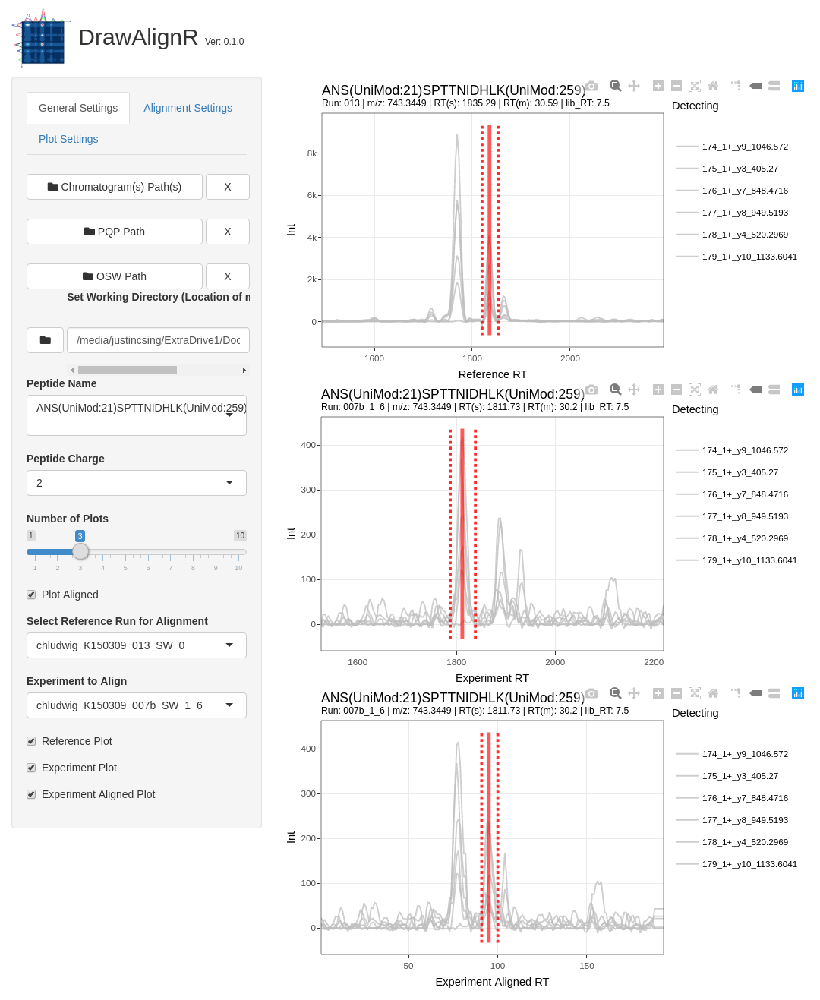

# DrawAlignR

An R package for the visualization of aligned ms2 chromatograms.

## Installation

To install this package, follow these commands:

``` r
require("devtools")
devtools::install_github("Roestlab/mstools")
devtools::install_github("shubham1637/DIAlignR")
devtools::install_github("Roestlab/DrawAlignR")
library(DrawAlignR)
```

## Overview

Illustration of general overview:


## Usage and Example

See Our Tutorial Vignette: [Tutorial_DrawAlignR.md](https://github.com/Roestlab/DrawAlignR/tree/master/vignettes/Tutorial_DrawAlignR.md)

### Example Alignment of A Phosphorylation Dilution Series Dataset



