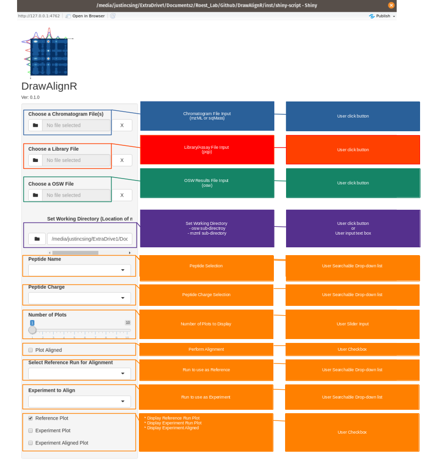
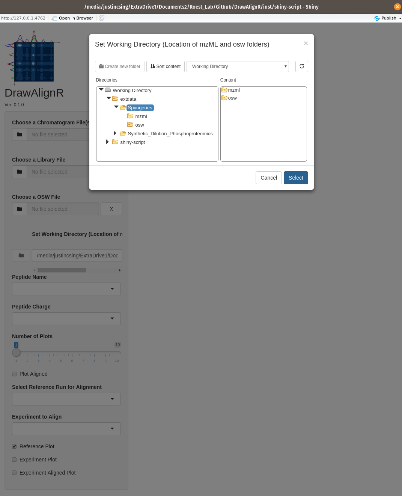
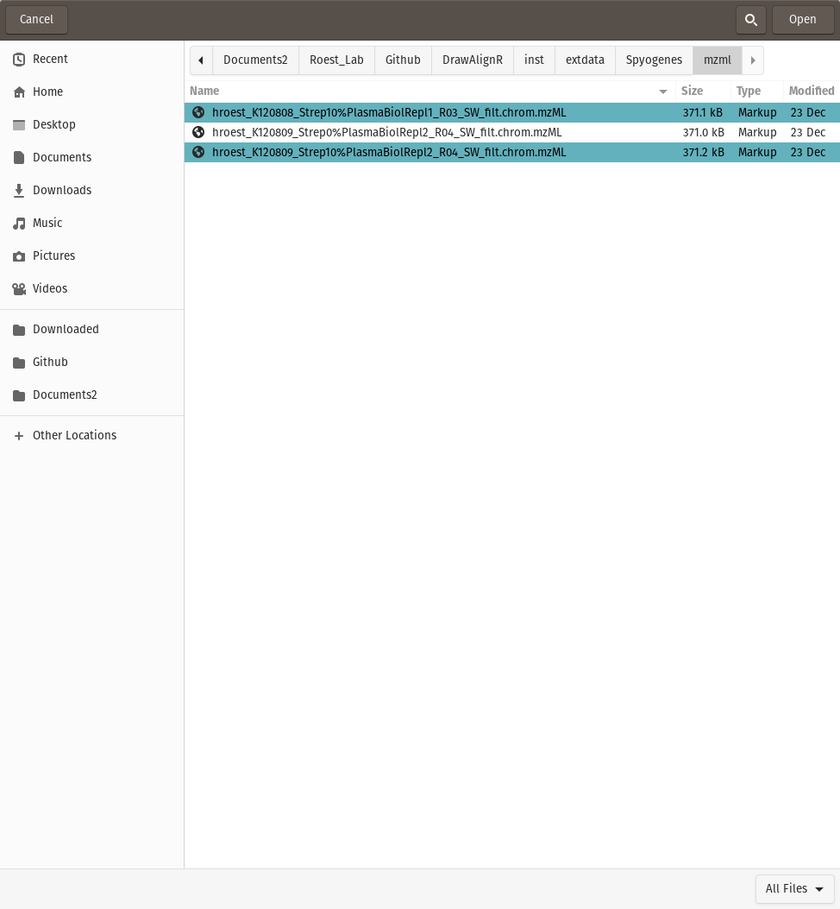
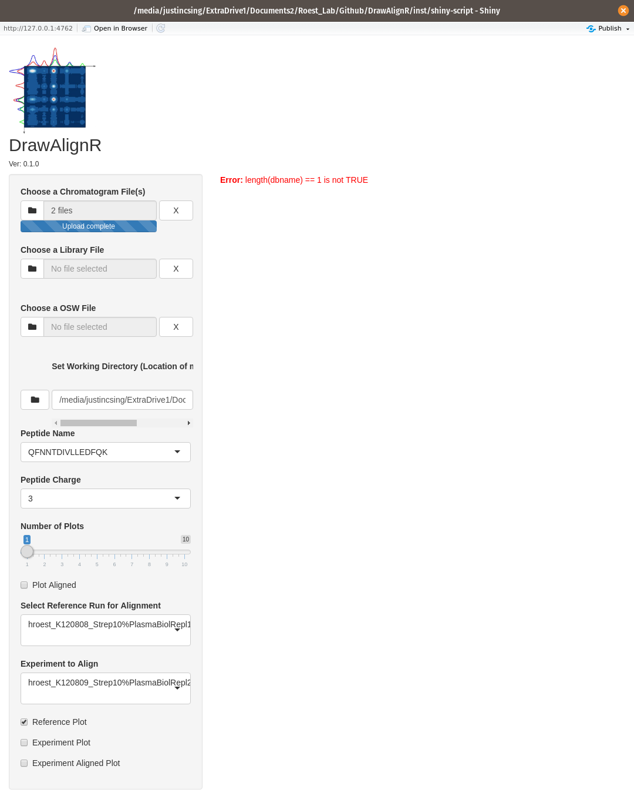
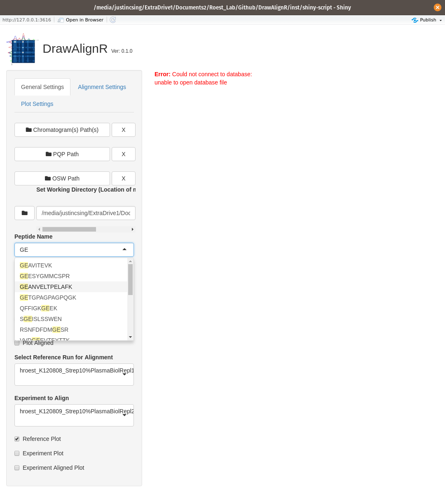
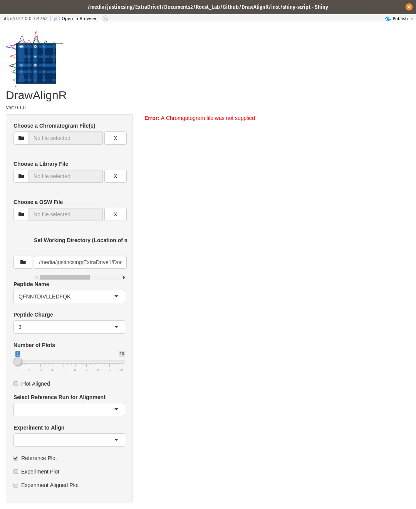
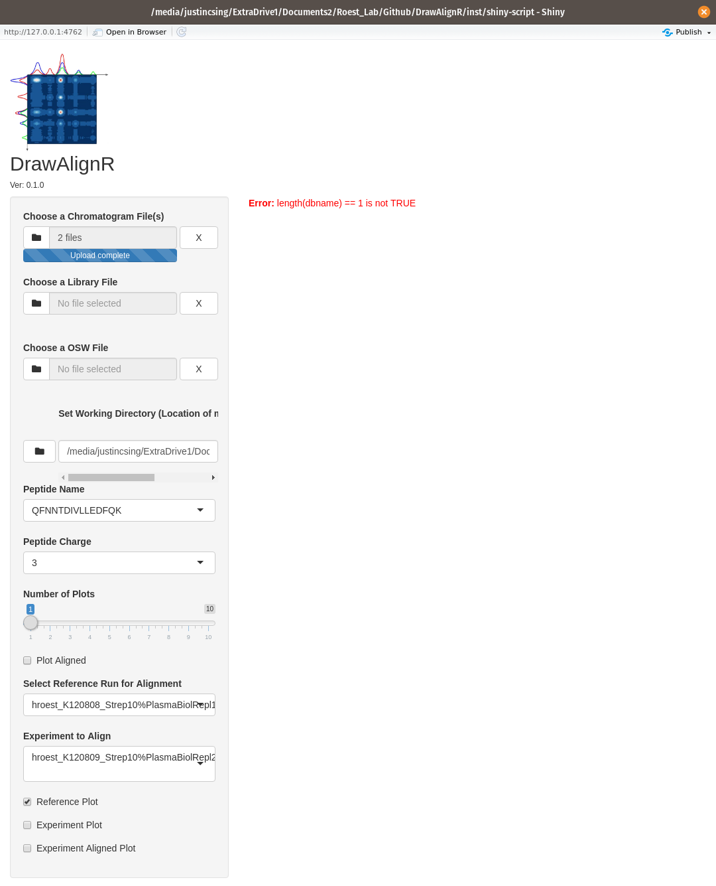
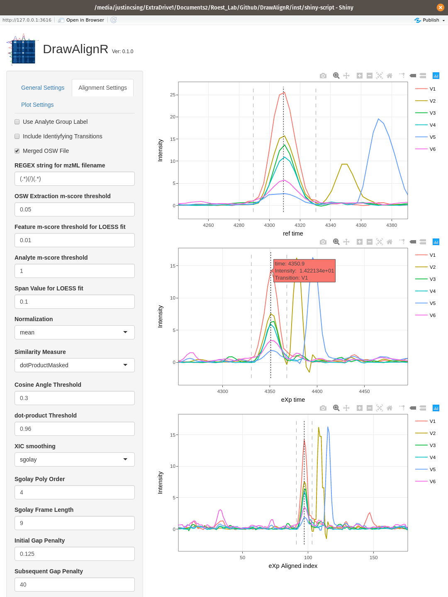
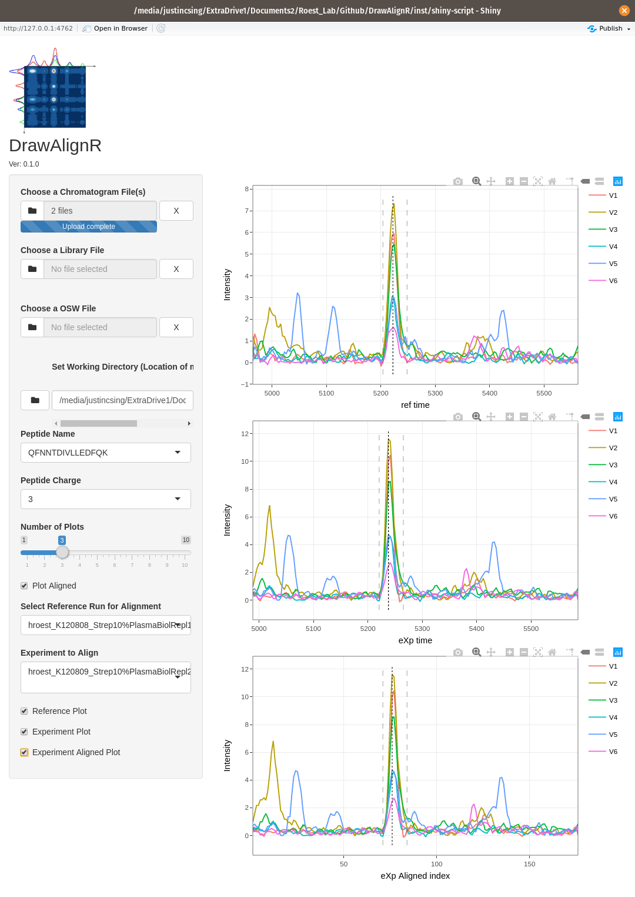

```{r setup, include=FALSE}
knitr::opts_chunk$set(echo = TRUE)
```

# Using/Calling DrawAlignR
## Calling tool via Installing DrawAlignR
```
## Install devtools if not already installed.
## install.packages("devtools")
## Install DrawAlignR from Roestlab Github Repository
devtools::install_github("Roestlab/DrawAlignR")
## To run the tool
DrawAlignR::runDrawAlignR()
```

## Calling tool via Github repo
```
shiny::runGitHub(repo = "Roestlab/DrawAlignR/", username = "Roestlab", subdir = "inst/shiny-script")
```

# User Interface


# Tutorial for Performing Alignment
## Set Working Directory

Use the Set Working Directory button to set the working directory that contains an mzml folder with .chrom.mzml files and an osw file with a merged.osw file. Or you can directly enter the path to the working directory using the input textbox area.


## Add Chromatogram files

Use the Choose a Chromatogram file button to select a chromatogram file(s) to upload. You can choose multiple files.



## Select a Peptide to visualize Chromatogram alignment

Choose which peptide you want to visualze using the Peptide dropdown list. The dropdown list is searchable, so you can easily search for a specific peptide to visualize.
The list of peptides is extracted from either the input library file if abailable, or an osw file if available.


## Select a Charge State for Selected Peptide

Choose which charge state to visualize for the selcted peptide.

## Select Reference Run and Experiment Run

Choose which chromatogram file to use as the reference run, and which chromatogram file to use as the experiment run. These are set through the searchable dropdown lists, which extracts the filenames from the supplied chromatogram files without the .chrom.mzml extension


## Select Plot Align checkbox to perform alignment

Check the Plot Aligned checkbox to perform the alignment of the two runs for the seleected peptide
You can also use the 
\item Reference Plot
\item Experiment Plot
\item Experiment Aligned Plot
to plot the different output extracted ion chromatogram results



The chromatogram plots are interactive, in that you can hover over the data points to see the *retention time*, *intentisty* and specific *transition* values.


You can also zoon in to specific regions of the chromatogram for a closer inspection.


